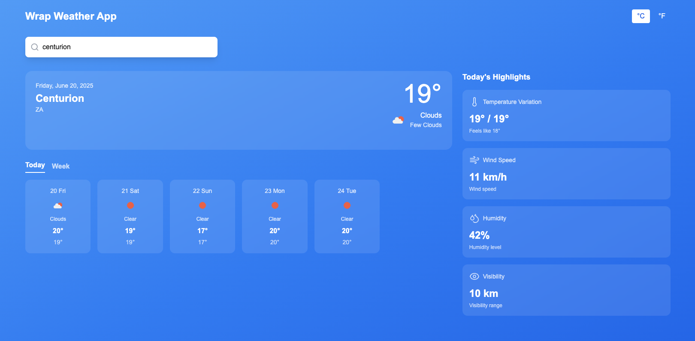
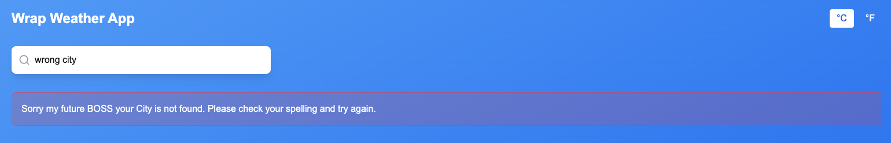

# Warp Weather App

A modern, responsive weather application built with Next.js 15 and the OpenWeatherMap API.

## Features

- 🌤️ Current weather display with detailed information
- 📅 6-day weather forecast
- 🔍 City search functionality
- 🌡️ Temperature unit toggle (Celsius/Fahrenheit)
- 📱 Responsive design
- ⚡ Loading states and error handling
- 🔒 Secure API key handling with environment variables

## Temperature Unit

This application displays temperatures in **Celsius** by default, with an the option to toggle to Fahrenheit using the temperature unit buttons in the top-right corner.

## Getting Started

### Prerequisites

- Node.js 18.18 or later
- npm, yarn, or pnpm
- OpenWeatherMap API key (free at [openweathermap.org](https://openweathermap.org/api))

### Installation

1. Clone the repository:
   \`\`\`bash
   git clone [https://github.com](https://github.com/CalvinD3v/warp-weather-app)
   cd warp-weather-app
   \`\`\`

2. Install dependencies:
   \`\`\`bash
   npm install
# or
yarn install
# or
pnpm install
\`\`\`

3. Create environment file:
   \`\`\`bash
   cp .env.local.example .env.local
   \`\`\`

4. Add your OpenWeatherMap API key to \`.env.local\`:
   \`\`\`env
   OPENWEATHER_API_KEY=your_api_key_here
   \`\`\`

5. Run the development server:
   \`\`\`bash
   npm run dev
# or
yarn dev
# or
pnpm dev
\`\`\`

6. Open [http://localhost:3000](http://localhost:3000) in your browser.

## Environment Variables

Create a \`.env.local\` file in the root directory with the following variables:

\`\`\`env
OPENWEATHER_API_KEY=your_openweathermap_api_key
\`\`\`

### Getting an API Key

1. Visit [OpenWeatherMap](https://openweathermap.org/api)
2. Sign up for a free account
3. Navigate to the API keys section
4. Copy your API key to the \`.env.local\` file

## Design Decisions

### API Security
- API key is stored in environment variables, never exposed to the client
- Next.js API routes proxy requests to OpenWeatherMap API
- Proper error handling for missing API key configuration
- Environment file is excluded from version control

### User Experience
- Clean, modern design with glassmorphism effects
- Responsive layout that works on all device sizes
- Loading states with spinner animation
- User-friendly error messages for different scenarios
- Temperature unit toggle for user preference

### Technical Architecture
- Used Next.js 15 with App Router for modern React development
- TypeScript for type safety and better developer experience
- Component-based architecture for reusability
- Proper separation of concerns with API routes
- Environment-based configuration for different deployment stages

### Weather Data
- Displays current weather conditions with icon
- Shows 6-day forecast with daily highs and lows
- Includes additional weather metrics (humidity, wind speed, visibility, feels-like temperature)
- Uses OpenWeatherMap icons for consistent weather representation

## API Integration

The app integrates with the OpenWeatherMap API to fetch:
- Current weather data for searched cities
- 5-day weather forecast data
- Weather icons and descriptions

Error handling covers:
- Invalid city names (404 responses)
- Network failures
- Missing API key configuration
- API rate limiting
- Malformed requests

## Technologies Used

- **Next.js 15** - React framework with App Router
- **TypeScript** - Type safety and developer experience
- **Tailwind CSS** - Utility-first CSS framework
- **Lucide React** - Icon library
- **OpenWeatherMap API** - Weather data source

## Project Structure

\`\`\`
warp-weather-app/
├── app/
│   ├── api/
│   │   └── weather/
│   │       └── route.ts          # API route for weather data
│   ├── components/
│   │   ├── WeatherCard.tsx       # Main weather display component
│   │   ├── ForecastCard.tsx      # Daily forecast component
│   │   └── HighlightCard.tsx     # Weather highlights component
│   ├── globals.css               # Global styles
│   ├── layout.tsx               # Root layout
│   └── page.tsx                 # Main page component
├── lib/
│   └── utils.ts                 # Utility functions
├── .env.local                   # Environment variables (not in git)
├── .gitignore                   # Git ignore rules
├── package.json                 # Dependencies and scripts
├── tailwind.config.ts           # Tailwind configuration
└── README.md                    # Project documentation
\`\`\`

## Future Enhancements

- Geolocation-based weather detection
- Weather alerts and notifications
- Historical weather data
- Multiple city comparison
- Weather maps integration
- auto-completion with google maps api
- PWA capabilities for offline usage
  \`\`\`

Let's also create an example environment file: